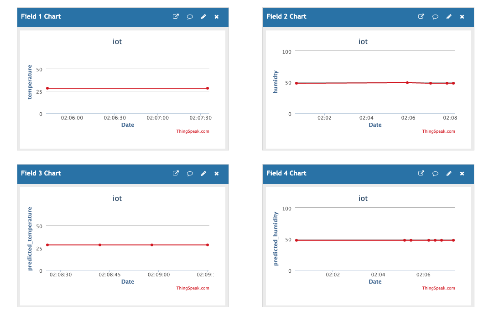

# IOT project

## catalog (all other parts should be started after finishing setting)

Catalog serves to register farm information (ID and name), sensor settings, services and also allows other services restrieve information from it. And also check any offline service and delete it from catalog.

Register any necessary information before runing other services.

Add Farm is to register farm with specifying the farm ID and farm Name.

Change Farm is to change the current farm and actiaveted farm, the inputed Farm ID must be the member of farms have been registered in the catalog. Activated Farm ID is the farm that could be activated. Users could get access the information of the current farm with telegram bot, Thingspeak and freeboard.

Token is to change the current telebram bot token in order to allow user to access the system. 

timer is to change the time interval for time scheduler for activating feeding mechanism.

Sensor settings is to change the settings of senors, DH11. The sensor number must match the number of sensor ports.

Delete Farm is to delete the farm that has been registered in catalog and it alse delete the sensor setting related to the deleted farm.

## Raspberry connector
Raspberry serves to read environmental information (temperature and humidity) from environment. And it also publish such information to ThingSpeak Adapter,humidity temperature statistic part (humidity predicter and temperature predicter). it also subscribe the cammand from environement control part to control watering, heating, cooling and fertilizer mechanisms.

Raspberry could be mapped to the activated farm automaticaly according to the starting order. For example, if in activated farm list, the first farm is the farm with ID 2 the second farm is the farm with ID 3, the first started raspberry would be mapped to the the farm with ID 2 and the second started raspberry would be mapped to the farm with ID 3. According to the farm ID, raspberry retrieve the sensors settings from catalog. Environment control part do so.

The actuators ports settings are predefined.

## environment control

Environment part is to pubish the command to raspberry with MQTT. It contains the humidity control part, temeprature control part, humidity predicter, temperature predicter, time schedular and feeding part.

Time schedular is publisher to publish the alert to the feeding, and the feeding publish the command to raspberry. 

Humidity and temperature subscribe the data from raspberry and retrive the predicted data, that are registed by humidity predicter and temperature predicter from catalog. And Humidty and temperature wighted sum the real data and predicted data to make decision for which command publish to raspberry.

The data used to train the NNs are simulated with sinusoidal function. And accounding to the test result, this training dataset works because the NNs just remember the partern rather than the number is they are not over-fitting. 

Even though the about 1% error is inevitable in the real usage, the performance of NNs are acceptable.

## telegram bot

telegram bot allows users to retrieve the status of greenhouse. And it also allows users to control the mechanisms manually. And telegram bot also provides the suggestion of some kinds plants. 

## thingspeak adapter

Thingspeak adataper subscribe the data from the raspberry and send to thingspeak.