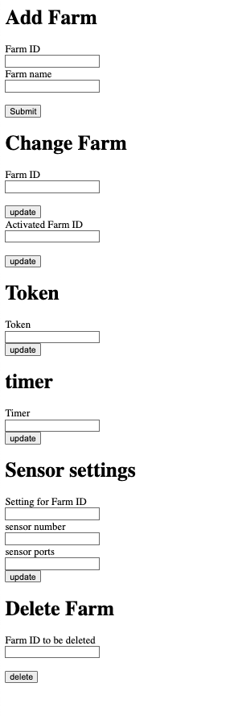

# IOT project

## catalog servers to register farm information, sensor settings, services and also allows other services restrieve information from it.

### Add Farm is to register farm 
### Change Farm is to change the current farm and actiaveted farm, the inputed Farm ID must be the member of farms have been activated in the catalog.
### Activated Farm ID is the farm that could be activated.
### Token is to change the current telebram bot token to allow user get access to the system. 
### timer is to change the time interval for time scheduler for activating feeding mechanism.
### Sensor settings is to change the setting of senors, DH11. The sensor number must match the sensor ports.
### Delete Farm is to delete the farm that has been registered in catalog
## Raspbeery connector, Raspberry.py, severs to read environmental information (temperature and humidity) from environment. And it also publish such information to ThingSpeak Adapter,humidity temperature statistic part (humidity predicter and temperature predicter)

